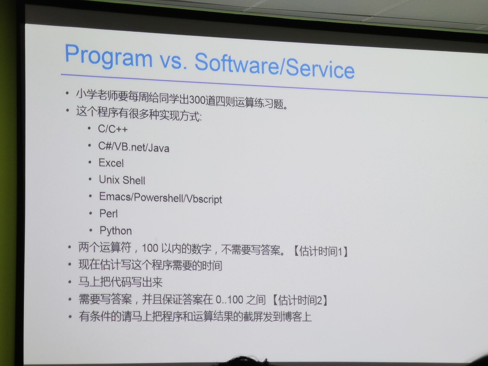
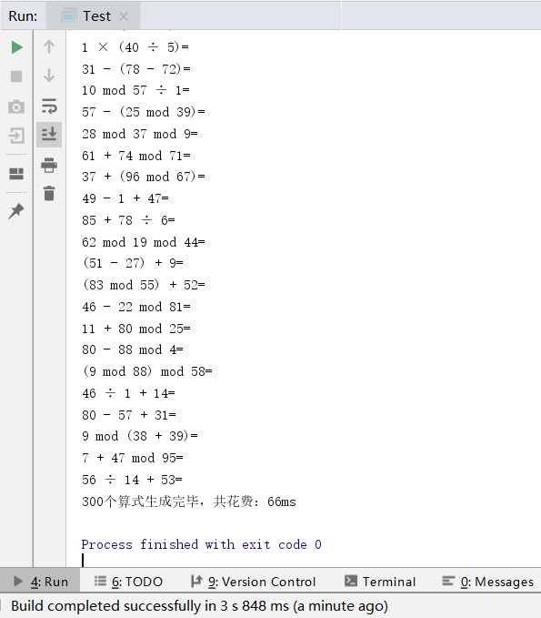
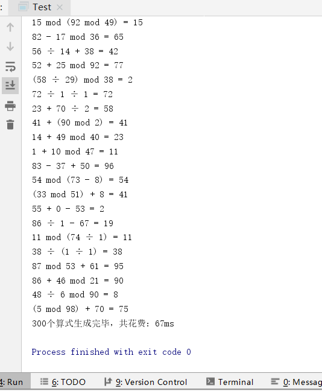

# ArithmeticGenerator算式生成器

# 截图



# 如何使用？
```java
 ArithmeticGenerator.with()
                .setOperandCount(3) // 设置运算数个数为3
                .setQuestionCount(300) // 设置生成的问题个数为300
                //.setNumRange(-100, 100) // 设置算式中运算数的范围，支持负数，默认0-100
                .setIntermediateResultRange(0, 100) // 设置中间计算结果的范围
                .setFinalResultRange(0, 100) // 设置最终计算结果的范围
                //.setShowFinalResult(true) // 是否显示算式计算结果
                //.setEnableBracket(true) // 启用括号，生成含括号的算式
                .setEnableExactDivision(true) // 启用整除，生成算式的除法运算中被除数必须被除数整除
                .addOperator(ArithmeticOperator.ADDITION) // 添加加法运算符
                .addOperator(ArithmeticOperator.SUBTRACTION) // 添加减法运算符
                .addOperator(ArithmeticOperator.MULTIPLICATION) // 添加乘法运算符
                .addOperator(ArithmeticOperator.DIVISION) // 添加除法运算符
                //.addOperator(com.zpj.arithmetic.impl.ArithmeticOperator.MOD) // 添加取余运算符
                .setListener(new ArithmeticGenerator.OnGenerateArithmeticListener() {
                    @Override
                    public void onGenerate(String arithmetic) {
                        System.out.println(arithmetic);
                    }
                }) //生成算式时的监听器
                .start(); // 启动生成器
```